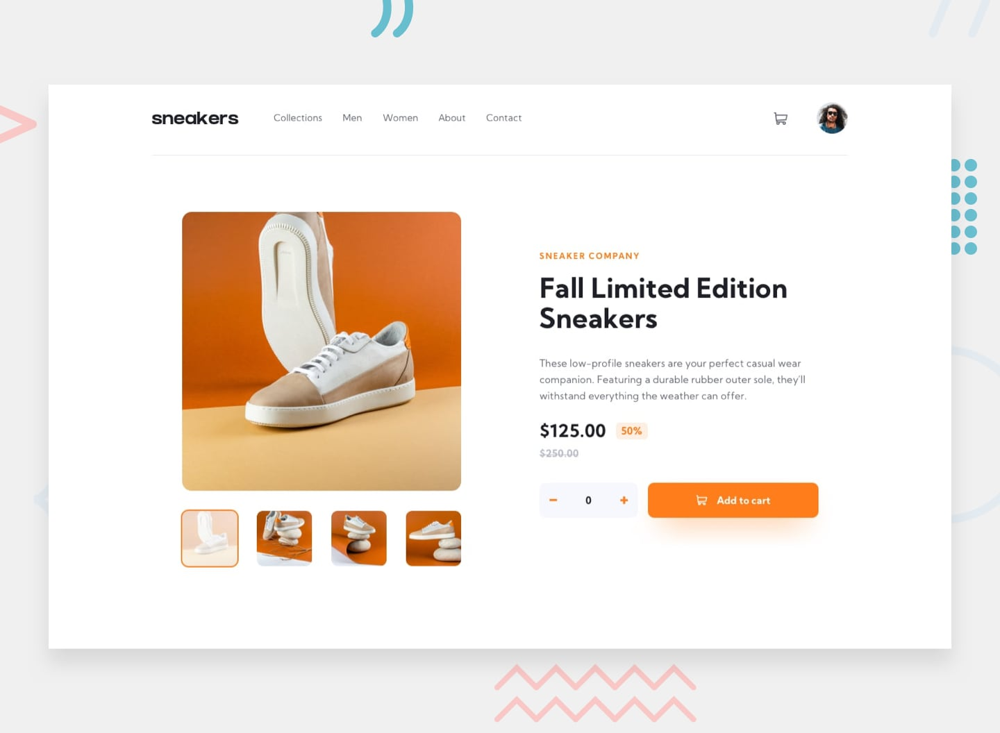

# Frontend Mentor - E-commerce product page solution

This is a solution to the [E-commerce product page challenge on Frontend Mentor](https://www.frontendmentor.io/challenges/ecommerce-product-page-UPsZ9MJp6).

## Table of contents

- [Overview](#overview)
  - [The challenge](#the-challenge)
  - [Screenshot](#screenshot)
  - [Links](#links)
- [My process](#my-process)
  - [Built with](#built-with)
  - [What I learned](#what-i-learned)
  - [Continued development](#continued-development)
- [Author](#author)

## Overview

### The challenge

Users should be able to:

- View the optimal layout for the site depending on their device's screen size
- See hover states for all interactive elements on the page
- Open a lightbox gallery by clicking on the large product image
- Switch the large product image by clicking on the small thumbnail images
- Add items to the cart
- View the cart and remove items from it

### Screenshot

### Links

- Solution URL: [link to the github repo](https://github.com/johakim-azix/e-commerce_product_page)
- Live Site URL: [live site URL here](https://johakim-azix.github.io/e-commerce_product_page/)

## My process
For this challenge, i started building the page template (first dom structure and then style) from large to small screens and for each component (header, cart, side navigation, image viewer...).
Once done with the page template, i moved to the javascript. I ended by testing.
 
### Built with

- Semantic HTML5 markup
- CSS custom properties, Flexbox, animations, transition
- Vanilla js

### What I learned

With my last challenge that you can view here ([the Chat app CSS illustration](https://johakim-azix.github.io/chat-app-illustration/)), i started using animations to improve user experience on my page; so with this challenge i learned a bit more and tried to apply it with moderation.
I improved the way i structure my code both js and css.  

### Continued development

I'll surely keep learning about better structuring my code and project, and some notions i've learned till now.

## Author
I am Marlonne and you can find me on these media : 
- Frontend Mentor - [@johakim-azix](https://www.frontendmentor.io/profile/johakim-azix)
- Github  - [johakim-azix](https://github.com/johakim-azix/)
- Twitter - [@marlonneazix](https://twitter.com/marlonneazix)
- Instagram - [@marlonne_penda](https://www.instagram.com/marlonne_penda/)
